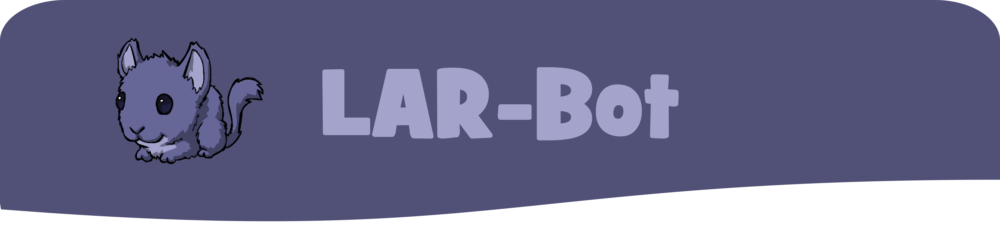

Lil Alchemist R Bot is a Discord bot built with Python and discord.py.

It's designed to provide useful features and fun commands related to Little Alchemist Remastered.

## 🌟 Features 🌟

- **Card Lookup**: Search for a card on the LAR wiki with the `/wiki` command.
- **Pack Opening**: Simulate opening a pack of cards.
- **Trivia**: Participate in trivia games and earn gems.
- **Shortcuts**: Use handy shortcuts for common tasks.
- **Help**: Show an overview of the currently available commands, combined with version history and current version

## 🛠️ Setup 🛠️

1. Clone this repository.
2. Install the required Python packages with `pip install -r requirements.txt`.
3. Set up your environment variables in a `.env` file. You'll need to set `DATABASE` to the path of your database file, and `ENVIRONMENT` to either `testing` or `production`. Finally, you set the bot token in the file.
   <br/>

### Overview of how this may look:

```
ENVIRONMENT=testing
DATABASE=playerdb.db
TOKEN=discordbottokenplaceholder
```

4. Run the bot with `python bot.py`.

## 📚 Commands 📚

- `/wiki <cardname> [is_onyx]`: Look up a card on the LAR wiki. If `is_onyx` is true, the bot will look up the Onyx version of the card.
- `/packopening <packname>`: Simulate a pack opening from the game. Returns 4 cards from that pack in one image.
- `/trivia`: Asks a trivia question. Answer correctly and gain some points. Answer wrongly and you will lose a lot!
- `/leaderboard`: Shows the trivia leaderboard
- `/help`: Shows an overview of all the available commands together with their description. Also shows version and update notes.

## 📝 Version 📝

Current version: 3.1.5
Version description: Fixes, readme & code cleanup

## 📜 License 📜

This project is licensed under the MIT License.
This includes:

- Commercial use: You can use the software for commercial purposes.
- Modification: You can modify the software.
- Distribution: You can distribute the software.

Enjoy using Lil Alchemist-R-Bot! 🎉
